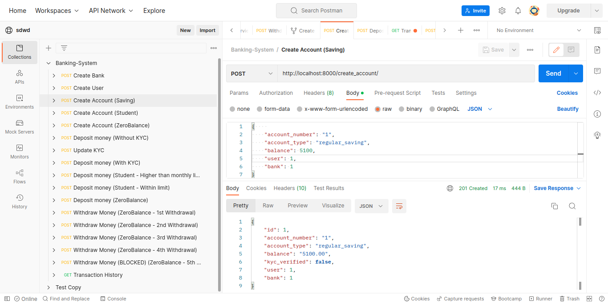
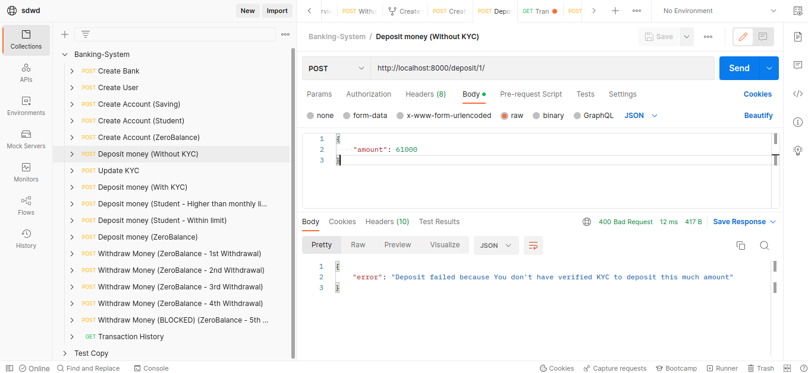
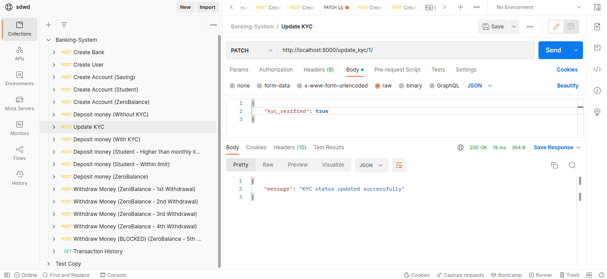
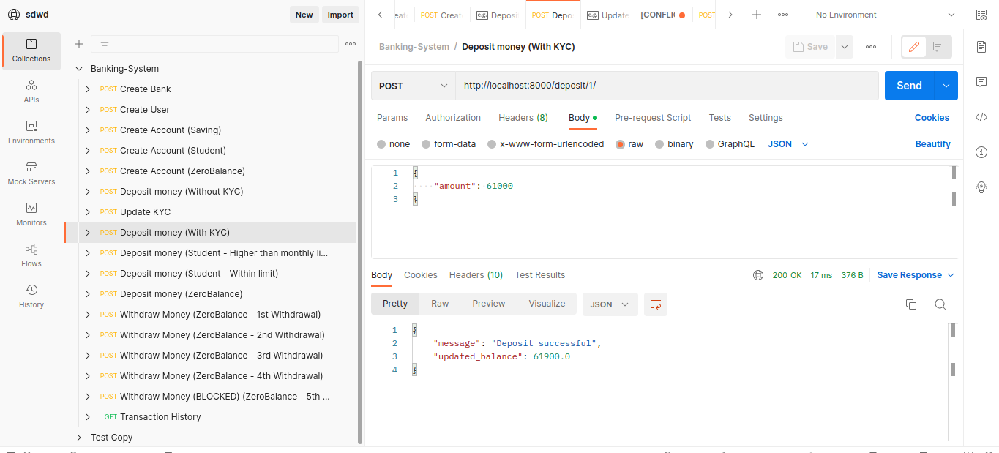
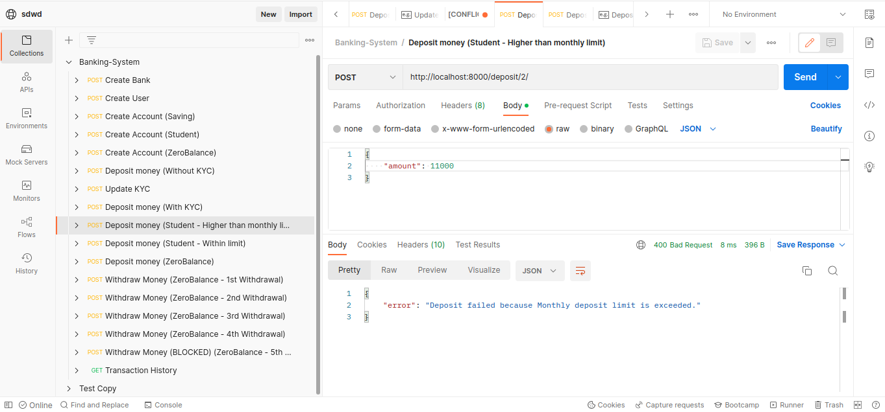
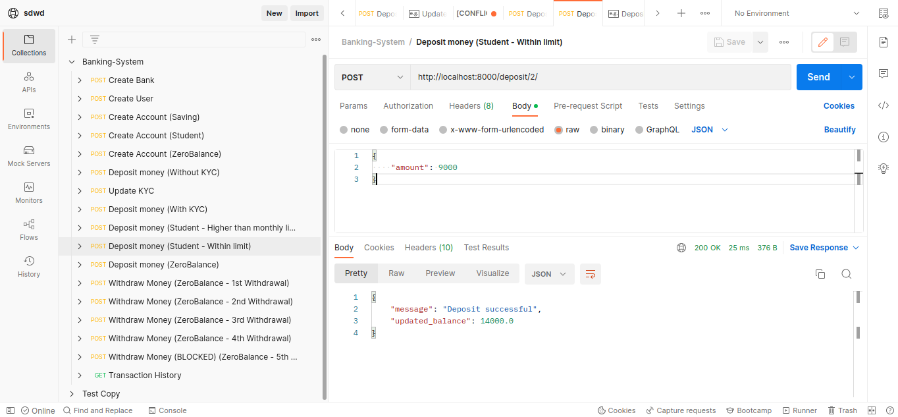
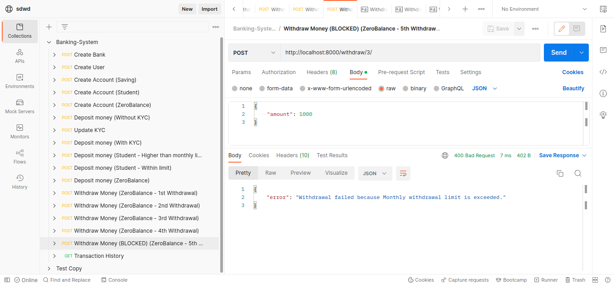
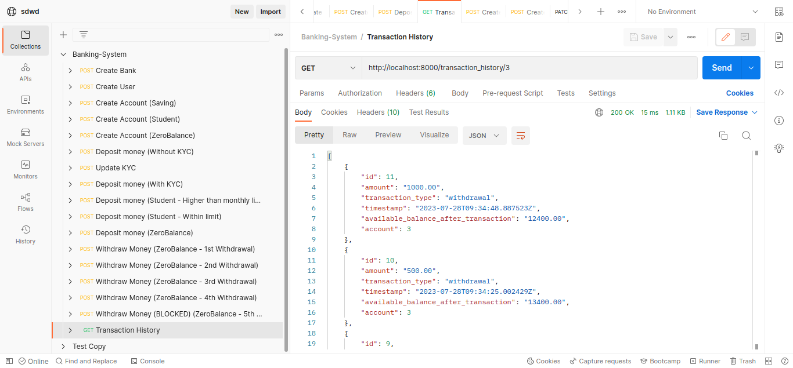

# Banking System
Banking System, a Django-based web application designed to manage different types of accounts and banking transactions. This project aims to provide a scalable and flexible solution for handling various account types, deposit and withdrawal rules, and transaction history.

## Features
1. Account Management:
   - Allow addition of accounts by providing an account number via input.

2. Transaction Handling:
   - Allow withdrawals from accounts.
   - Allow deposits to accounts.
   - Print transaction history for each account.

3. Account Types and Withdrawal Rules:
   - Define different account types with specific withdrawal rules:
     - Zero Balance Account:
       - Allow only 4 withdrawals in a month.
       - Block further withdrawals once the limit is reached.

     - Student Account:
       - Allow only 4 withdrawals in a month.
       - Block further withdrawals once the limit is reached.
       - Require a minimum balance of 1000 rupees to withdraw. System won't allow withdrawals beyond this min balance.

     - Regular Saving Account:
       - Allow only 10 withdrawals in a month.
       - Charge 5 rupees per withdrawal for withdrawals beyond the limit.
       - Require a minimum average balance of 5000 rupees for the last 90 days.

4. Deposit Rules:
   - Define deposit rules based on account type:
     - Student Account:
       - Disallow depositing more than 10,000 rupees per month.
       - No restriction on the total balance.
     - Regular Saving Account:
       - Disallow depositing more than 50,000 rupees unless the KYC is verified. Otherwise, the deposit fails.

## Installation

### Docker Installation:
1. Install Docker on your system if not already installed.
2. Clone the repository from GitHub: `git clone https://github.com/arpitptl/banking-system.git`
3. Navigate to the project directory: `cd banking-system`
4. Build the Docker image: `docker build -t banking-system .`
5. Run the Docker container: `docker run -p 8000:8000 banking-system`

### Normal Installation (Without Docker):
1. Clone the repository from GitHub: `git clone https://github.com/arpitptl/banking-system.git`
2. Navigate to the project directory: `cd banking-system`
3. Create a virtual environment (optional but recommended): `python -m venv venv`
4. Activate the virtual environment: 
   - On Windows: `venv\Scripts\activate`
   - On macOS and Linux: `source venv/bin/activate`
5. Install the required dependencies: `pip install -r requirements.txt`
6. Run the development server: `python manage.py runserver`

## Run Test Cases
To run the test cases for the core app, use the following command:
`python manage.py test core.tests`

## Postman Collections
You can find the Postman collections for interacting with the Banking System API in the `postman_collections` folder. Import these collections into your Postman app to access pre-defined API requests.

## Screenshots
Attaching some of the Postman API request screenshot for reference. 

#### Create Account

#### Deposit Money without KYC (>50000)

#### Update KYC

#### Deposit Money After KYC

#### Deposit in Student Account ( > Monthly Deposit Limit)

#### Deposit in Student Account ( Within Monthly Deposit Limit)

#### Withdraw from ZeroBalance Account ( > No of Monthly withdrawal Limit)

#### Transaction History
